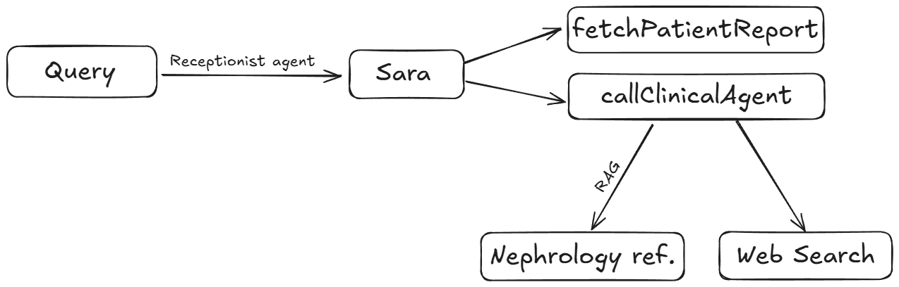
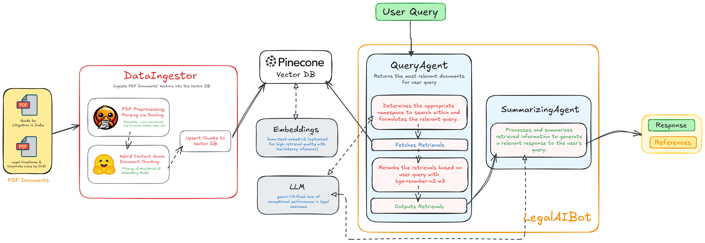

# Post Discharge Medical AI Assistant

Post Discharge Medical AI Assistant is a multi-agent chatbot system designed to assist patients with post-hospitalization care. Built using modern Generative AI techniques, the system provides personalized follow-up, medical guidance, and educational support based on each patient’s discharge report and nephrology-specific reference material.

This assistant simulates a realistic care experience using two AI agents:

_Receptionist Agent_ : Greets the patient, retrieves their discharge report, and asks personalized follow-up questions.

_Clinical AI Agent_ : Answers medical queries using Retrieval-Augmented Generation (RAG) from nephrology guidelines, and provides fallback responses via web search when needed.




## Table of Contents

- [Installation](#installation)
- [Usage](#usage)
- [Project Structure](#project-structure)
- [Environment Variables](#environment-variables)
- [Contributing](#contributing)
- [License](#license)

## Installation

1. Clone the repository:

   ```sh
   git clone https://github.com/sanketdisale871/Post-Discharge-Medical-AI-Assistant.git
   ```

2. Create a virtual environment and activate it:

   ```sh
   python -m venv venv
   source venv/bin/activate  # On Windows use `venv\Scripts\activate`
   ```

3. Install the required dependencies:

   ```sh
   pip install -r requirements.txt
   ```

4. Set up environment variables:
   Create a `.env` file in the root directory and add the following variables:
   ```env
   GEMINI_API_KEY=your_gemini_api_key
   GOOGLE_API_KEY=your_google_api_key
   PINECONE_API_KEY=your_pinecone_api_key
   LANGSMITH_TRACING=true
   LANGSMITH_ENDPOINT="https://api.smith.langchain.com"
   LANGSMITH_API_KEY=your_langsmith_api_key
   LANGSMITH_PROJECT="datasmith"
   ```

## Usage

1. Ingest data into Pinecone:

   ```sh
   python ingest_data.py
   ```

2. Run the Streamlit app:

   ```sh
   streamlit run app.py
   ```

## Project Structure

The repository is organized as follows:

```
PostDischargeAI/
├── data/                      # Input data and reference files
│   ├── patient_reports.json   # 25+ dummy discharge reports
│   ├── article_1.pdf          # Additional nephrology article (optional)
│   └── clinical-handbook-of-nephrology.pdf  # Nephrology reference book for RAG
│
├── src/                       # Main source code
│   ├── agents/                # Multi-agent logic
│   │   ├── base_agents.py
│   │   ├── clinical_agent.py
│   │   └── receptionist_agent.py
│   │
│   ├── core/
|   |   ├── config.py               # Models
│   │
│   ├── ingestor/              # Scripts for loading, chunking, and embedding PDFs
|   |   ├── DataIngestor.py
│   │
│   ├── tools/                 # Utility tools used by agents
│   │   ├── clinical_tools.py
│   │   ├── rag_tool.py
│   │   ├── receptionist_tools.py
│   │   ├── schema.py
│   │   └── tool_functions.py
│   │
│   ├── utils/                 # Agents Prompt
│   │   └── prompts.py
|   |   └── constants.py
│
├── venv/                      # Python virtual environment
│
├── .env                       # Environment variables
```

## Contributing

Contributions are welcome! Please open an issue or submit a pull request for any improvements or bug fixes.

## License

This project is licensed under the MIT License. See the [LICENSE](LICENSE) file for details.
